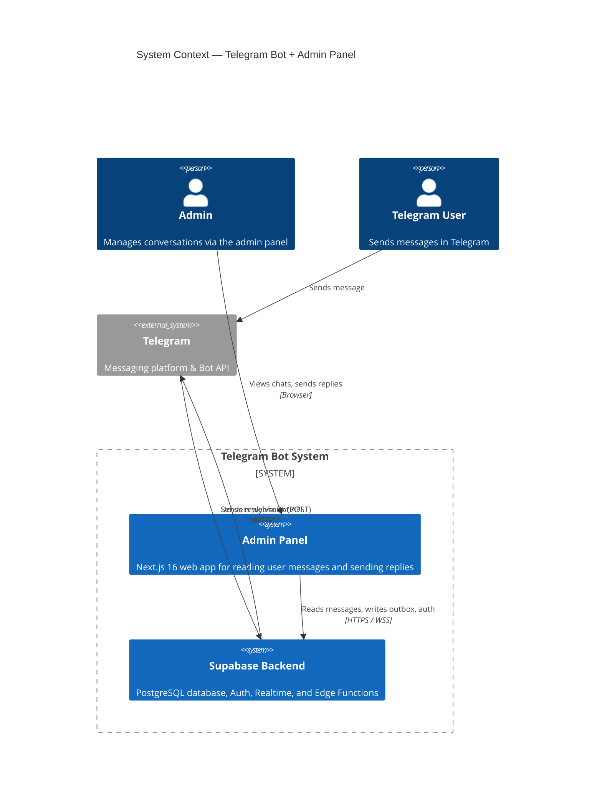
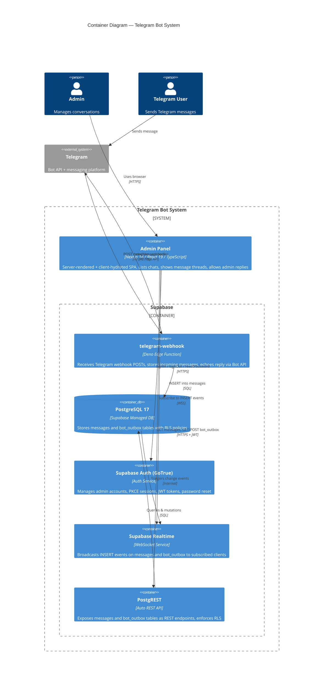
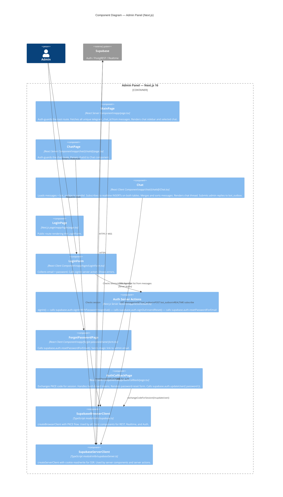
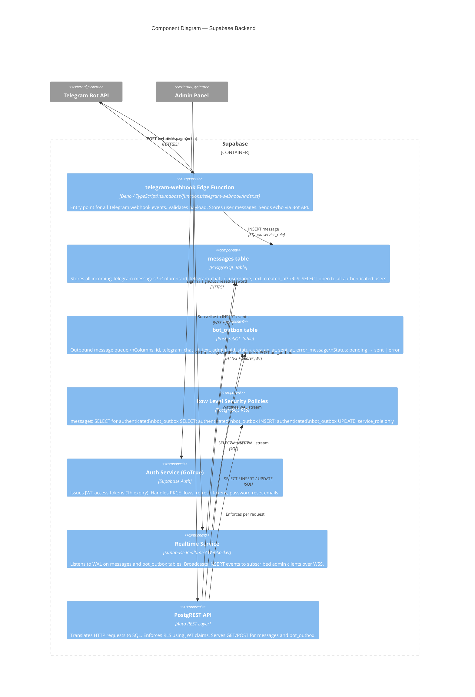

# C4 Architecture Diagrams — Telegram Bot Admin Panel

## Level 1: System Context

---

## Level 2: Container

---

## Level 3: Component — Admin Panel

---

## Level 3: Component — Supabase Backend

